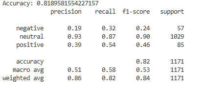

## 📝 Назначение модели
Модель предназначена для автоматической классификации комментариев ВКонтакте по тональности:
- **positive** — позитивные комментарии  
- **negative** — негативные комментарии  
- **neutral** — нейтральные комментарии  

## 📊 Тип модели
- Logistic Regression (LogReg)
- Векторизация: TF-IDF
- Базовая лексическая разметка через RuSentiLex

## 🧩 Входные данные
- Текстовые комментарии на русском языке
- Максимальная длина/количество токенов не ограничено, но применяется очистка текста

## 🏗 Архитектура
1. Очистка текста (демонстрационные символы, ссылки, упоминания)  
2. Токенизация  
3. Разметка через гибридный RuSentiLex + ML подход  
4. TF-IDF векторизация  
5. Классификация Logistic Regression  

## 📈 Метрики
На тестовом датасете (`data/labeled/comments_v2.csv`):

> ⚠️ Модель склонна переоценивать нейтральные комментарии, однако ложноположительные positive/negative метки практически не появляются.

## ⚠️ Ограничения
- Подходит только для русского языка
- Не учитывает сарказм, эмодзи и контекст за пределами одного комментария
- Нужна регулярная переобучаемость при обновлении данных
