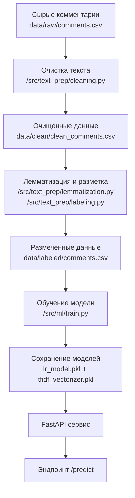

# VK Comment Sentiment Analysis

[](https://www.python.org/)
[](https://opensource.org/licenses/MIT)
[](https://fastapi.tiangolo.com/)
[](https://www.docker.com/)
[](https://scikit-learn.org/)

Анализ тональности комментариев ВКонтакте с использованием RuSentiLex и ML-модели.

---
## 📊 Возможности

- Автоматическая очистка и предобработка текста
- Лемматизация и нормализация русскоязычного текста
- ML-модель для классификации тональности (Logistic Regression)
- FastAPI для инференса в реальном времени
- Docker-контейнеризация

## 🏗️ Структура проекта
```
├─ .gitignore
├─ config.yaml
├─ data/
├─ models/
├─ src/
│ ├─ inference/
│ ├─ ml/
│ └─ text_prep/
├─ requirements.txt
├─ run_pipeline.py
└─ README.md
```

---

## 🚀 Быстрый старт

### 1. Клонирование репозитория
```bash
git clone https://github.com/flagg11/text-mlops-kusrach.git
cd text-mlops-kutsach
```


### 2. Установка зависимостей

Создайте виртуальное окружение и установите зависимости:

```bash
python -m venv .venv
source .venv/bin/activate      # Linux / macOS
.venv\Scripts\activate         # Windows

pip install --upgrade pip
pip install -r requirements.txt
```


### 3. Настройка конфигурации

```bash
# Копирование шаблона .env файла
cp .env.example .env
# Отредактируйте .env файл при необходимости
```

### 4. Запуск пайплайна

Подготовка данных, обучение модели и сохранение артефактов:

```bash
python run_pipeline.py
```
---
## 📈 Пайплайн обработки


### FastAPI в этом случае запустится автоматически, если в config.yaml не указано обратное

Эндпоинты:

- /health — проверка, что сервис работает(должен вернуть "ok")
- /predict — приём JSON с комментариями и возврат предсказаний

Пример запроса:
```python
import requests

data = {"comments": "Полный ужас, отвратительный сервис, всё сломано, никто не помогает!", "Еда норм."]}
resp = requests.post("http://127.0.0.1:8000/predict", json=data)
print(resp.json())
```

## 🔌 API Документация

После запуска сервиса будет доступен:
<b>
- Swagger UI: http://localhost:8000/docs

- ReDoc: http://localhost:8000/redoc
</b>
---

## 🐳 Docker

Сборка и запуск контейнера:
```bash
docker build -t vk_commentary_sentiment_analysis .
docker run -p 8000:8000 vk_commentary_sentiment_analysis
```


## 📝 License

MIT


